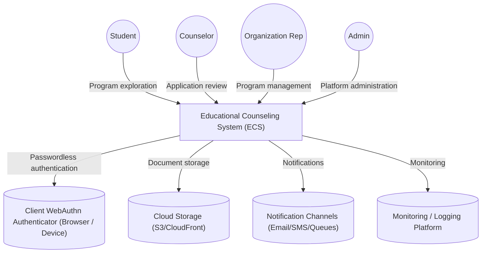
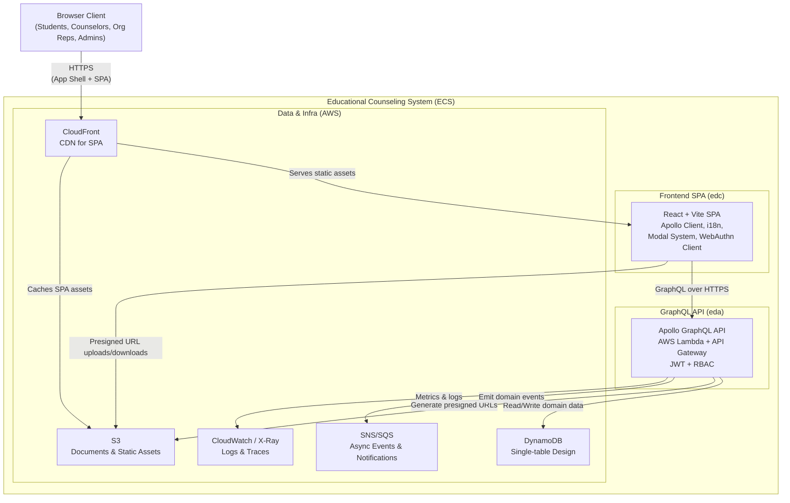
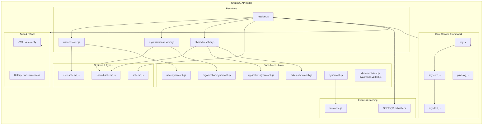
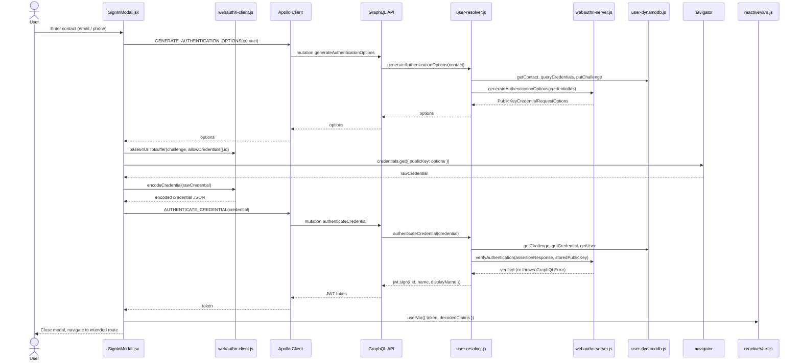
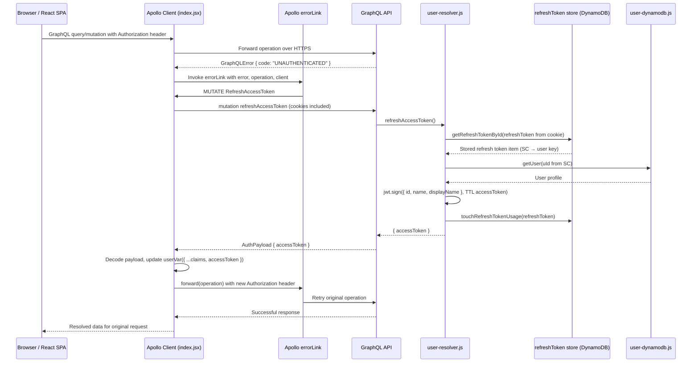
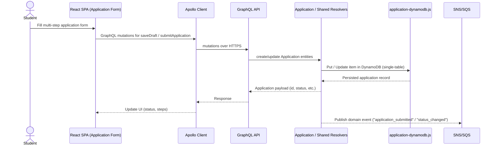

Educational Counseling System (ECS) Architecture 
===

# Purpose

# High-level Summary

- What: ECS is a serverless, role-aware educational counseling platform built as a React SPA backed by a GraphQL API.
- Who it serves: Students, counselors, institutions, organization representatives, and admins through program browsing, applications, reviews, notifications, and account management.
- Frontend: React + Vite SPA, Apollo Client, styled-components, i18next, modal-driven auth, WebAuthn integration, responsive breakpoints.
- Backend: Apollo GraphQL on AWS Lambda, DynamoDB single-table design, S3 document storage, SNS/SQS for async processing, JWT-based RBAC.
- Key flows: Passwordless authentication, program search, multi-step applications, file uploads, reviewer workflows, notifications, profile/account hub, role-aware navigation.
- Infra & observability: CloudFront + S3 hosting, CloudWatch logs & metrics, AWS X-Ray tracing.
- Relevant frontend directories (in `edc`): `src/`, `src/service/webauthn-client.js`, `src/apollo/`.

# C4 Diagrams

## C1 — System Context Diagram



 * ECS system is composed of: frontend SPA (edc repo) and backend GraphQL API (eda repo).
### Primary Users

- Students: Own their application journey end to end — from discovery (searching and saving programs) through document upload, submission, and tracking decisions.

- Counselors: Work mostly from application and student views, leaving notes, updating statuses, and monitoring deadlines for their assigned students.

- Organization Representatives: Focus on keeping program and organization data current, managing which counselors or reviewers are attached to which programs.

- Institutions: Consume ECS primarily as the destination for applications and related data, feeding their own internal review processes.

- Admins: Configure global settings (roles, feature flags, limits), handle exceptional user management, and review audit trails.

### External Systems & Interactions

- Passwordless authentication via WebAuthn: ECS owns the full WebAuthn flow (option generation, credential verification) and issues JWTs itself; there is no separate identity provider to manage. The browser/device authenticator holds the private keys; ECS persists only the corresponding public credential records and user data in DynamoDB.

- AWS S3: Used both as a durable store for user-uploaded documents (via presigned URLs) and as static hosting  wfor built frontend assets behind a CDN.
- AWS SNS/SQS: Carries domain events such as “application submitted” or “status changed” so that notification senders and background workers can be loosely coupled from the core API.
- Observability stack (CloudWatch, X-Ray, etc.): Captures logs, metrics, and traces for all API calls and background jobs, and is the primary toolset used during on-call and performance investigations.


---

## C2 — Containers



### Frontend (React SPA — `edc` repo)

- Responsibilities: Render all user-facing flows, manage authenticated sessions via JWT + Apollo reactive vars, handle WebAuthn registration/authentication, execute GraphQL operations, drive responsive UI, upload files to S3 via presigned URLs.
- Technology: React + Vite, Apollo Client, styled-components with centralized breakpoints (`src/component/breakpoints.js`), i18next for localization (`lngVar`), modal system (`ModalContext`, `ModalManager`, React portals), WebAuthn utilities for credential encoding/decoding.
- Interactions: Talks to the GraphQL API, uploads to S3, updates `userVar`/`lngVar`, renders role-aware navigation and protected routes.

### Backend (GraphQL API on AWS Lambda — `eda` repo)

- Responsibilities: Serve the GraphQL schema/resolvers, generate WebAuthn challenges, verify credentials, issue JWTs, enforce RBAC using token claims, drive CRUD logic for domain entities, emit domain events to SNS/SQS.
- Technology: Apollo Server on AWS Lambda, API Gateway integration, JWT signing/verification, RBAC middleware, Node.js runtime.
- Interactions: Reads/writes DynamoDB, generates presigned S3 URLs, emits SNS/SQS events, exposes the SPA's single GraphQL endpoint.

### Persistence & Infrastructure

- DynamoDB: Single-table design for all domains (users, orgs, institutions, programs, applications) with GSIs such as "applications by student".
- S3: Stores supporting documents and static assets; used for uploads (presigned URLs) and public hosting.
- SNS/SQS: Queues/topics for notification processing and workflow transitions.
- CloudFront + S3: CDN distribution for frontend assets.
- CloudWatch + X-Ray: Logs, metrics, and trace visualization for operations.

---

## C2.5 — Deployment

- Frontend: Vite build output deployed to S3 and distributed via CloudFront.
- Backend: GraphQL API packaged as Lambda functions behind API Gateway.
- Auth: Server performs WebAuthn validation and issues JWTs after credential verification.
- Observability: CloudWatch (metrics/logs) plus AWS X-Ray for distributed request tracing.

---

## C2.6 — UX / Client-Side Design

### Screens & Flows

- Authentication (WebAuthn): Generate options → WebAuthn API → encode credentials → submit to GraphQL → receive JWT.
- Dashboard: Role-aware landing views for students, counselors, org reps, and admins.
- Program catalog & search: Search, filter, browse, and inspect program details.
- Application flow: Multi-step forms with draft autosave, presigned S3 uploads, review, and final submission.
- Notifications center: Sorted updates for applications, deadlines, and messages.
- Account hub: `UserMenu` links to Profile (protected `/profile` view with decoded account metadata), Account Settings, My List, and My Applications, giving authenticated users fast access alongside sign-out.

### Key UI Primitives

- Navigation components: `NavTop`, `NavBottom`, `NavBar*`.
- User menu system: `AuthButtons`, `UserMenu`, dropdown internals (`UserMenuToggle`, `UserMenuList`) for authenticated navigation and sign-out.
- Auth UI: `SignInModal`, `SignUpModal` for modal-driven WebAuthn flows.
- Forms: `Inputs` and related components wired to GraphQL mutations.
- Language selector: `LanguageDropdown` updates `lngVar` and i18next state.

### Client Wiring Notes

- App initialization in `src/index.jsx` wires `ApolloProvider`, `LanguageProvider`, and `RouterProvider`.
- GraphQL endpoint comes from `import.meta.env.VITE_GRAPHQL_ENDPOINT`.
- `userVar` and `lngVar` drive navigation, rendering, and session state.
- `reportWebVitals` optionally collects Web Vitals metrics.

---

## C3 — Components
### Backend Components


- **GraphQL resolvers**: `user-resolver.js`, `organization-resolver.js`, `shared-resolver.js`, and the root `resolver.js` coordinate schema-level operations for users, organizations, institutions, programs, applications, notifications, and admin utilities.
- **Schema & types**: `schema.js`, `user-schema.js`, and `shared-schema.js` define the public GraphQL surface consumed by the SPA.
- **Data access layer**: `user-dynamodb.js`, `organization-dynamodb.js`, `application-dynamodb.js`, `admin-dynamodb.js`, `dynamodb.js`, and related tests (`dynamodb.test.js`, `dynamodb-v2.test.js`) encapsulate single-table DynamoDB patterns, GSIs, and query helpers.
- **Core service framework**: `tiny.js`, `tiny-core.js`, `tiny-dest.js`, and `pino-log.js` standardize Lambda-style handlers, logging, error handling, and configuration.
- **Event & cache utilities**: SNS/SQS publisher helpers for domain events plus `lru-cache.js` for hot-path caching where appropriate.
- **Auth & RBAC**: JWT issuance/verification and role/permission checks wired through the GraphQL server context and middleware.

### Frontend Components (Selected)
```mermaid
graph TB
  subgraph Frontend["SPA (edc)"]
    direction TB

    subgraph ShellRouting["Shell & Routing"]
      APP["App.jsx"]
      ROUTES["routes.jsx"]
      LANG_CTX["LanguageContext.js"]
      I18N["i18n.js"]
      ENTRY["index.jsx"]
    end

    subgraph NavLayout["Navigation & Layout"]
      NAV_TOP["NavBarTop.jsx"]
      NAV_BU["NavBarBottomUpper.jsx"]
      NAV_BL["NavBarBottomLeft.jsx"]
      LOGO["Logo.jsx"]
      CONTENT["ContentArea.jsx"]
      HOME["Home.jsx"]
    end

    subgraph DomainViews["Domain Views"]
      COLLEGES["Colleges.jsx"]
      RANKINGS["CollegesRankings.jsx"]
      GRAD["GraduateSchools.jsx"]
      K12["K12s.jsx"]
      PROFILE["Profile.jsx"]
      ACCOUNT["Account.jsx"]
    end

    subgraph AuthMenu["Auth & User Menu"]
      AUTH_BTNS["AuthButtons.jsx"]
      SIGNIN["SignInModal.jsx"]
      SIGNUP["SignUpModal.jsx"]
      USERMENU["UserMenu.jsx"]
      PROTECTED["ProtectedRoute.jsx"]
    end

    subgraph Modals["Modal Infrastructure"]
      MODAL_CTX["ModalContext.jsx"]
      MODAL["Modal.jsx"]
      MODAL_MGR["ModalManager wiring"]
    end

    subgraph ApolloClient["GraphQL Client Utilities"]
      VARS["apollo/reactiveVars.js\n(userVar, lngVar)"]
      AUTH_Q["apollo/authQueries.js"]
      AUTH_M["apollo/authMutations.js"]
      AUTH_LINK["index.jsx\n(authLink → Authorization header)"]
    end

    subgraph Styling["Styling & Responsiveness"]
      GLOBAL_CSS["index.css"]
      BREAKPOINTS["component/breakpoints.js"]
    end
  end

  %% Wiring
  ENTRY --> APP
  APP --> ROUTES
  APP --> LANG_CTX
  APP --> I18N
  APP --> ApolloClient

  APP --> NavLayout
  NavLayout --> DOMAINVIEWS[["Domain Views"]]
  DOMAINVIEWS --> DomainViews

  USERMENU --> PROFILE
  USERMENU --> ACCOUNT

  ROUTES --> PROTECTED
  PROTECTED --> AUTH_BTNS

  AUTH_BTNS --> SIGNIN
  AUTH_BTNS --> SIGNUP
  AUTH_BTNS --> USERMENU

  MODAL_CTX --> MODAL_MGR
  MODAL_MGR --> SIGNIN
  MODAL_MGR --> SIGNUP
  MODAL_MGR --> MODAL

  ApolloClient --> VARS
  ApolloClient --> AUTH_Q
  ApolloClient --> AUTH_M
  ApolloClient --> AUTH_LINK

  Styling --> NavLayout
  Styling --> DomainViews
  Styling --> AuthMenu
  ```
- **Shell & routing**: `App.jsx`, `routes.jsx`, `LanguageContext.js`, `i18n.js`, and `index.jsx` compose `ApolloProvider`, language provider, and router, and define public routes with role-aware navigation.
- **Navigation & layout**: `NavBarTop.jsx`, `NavBarBottomUpper.jsx`, `NavBarBottomLeft.jsx`, `Logo.jsx`, `ContentArea.jsx`, and `Home.jsx` provide the main frame and global navigation chrome.
- **Domain views**: `Colleges.jsx`, `CollegesRankings.jsx`, `GraduateSchools.jsx`, `K12s.jsx`, `Profile.jsx`, and `Account.jsx` implement exploration, ranking, and user-centric views (profile and account management) for different education segments and roles.
- **Authentication & user menu**: `AuthButtons.jsx`, `SignInModal.jsx`, `SignUpModal.jsx`, and `UserMenu.jsx` coordinate WebAuthn-based login, session display, navigation to `Profile` / `Account`, and sign-out; `ProtectedRoute.jsx` guards sensitive paths.
- **Modal infrastructure**: `ModalContext.jsx`, `Modal.jsx`, and the `ModalManager` wiring centralize modal state and portal-based rendering.
- **GraphQL client utilities**: `apollo/reactiveVars.js`, `apollo/authQueries.js`, and `apollo/authMutations.js` define `userVar`/`lngVar`, authentication operations, and shared client-side state. `index.jsx` wires an Apollo `authLink` that reads the JWT from `userVar` and sets the `Authorization: Bearer <token>` header on each GraphQL request.
- **Styling & responsiveness**: `index.css` and `component/breakpoints.js` define global styles and responsive breakpoints used by `styled-components`.

---

## C4 — Code / Implementation Details

### WebAuthn Registration Flow (End-to-End)

```mermaid
sequenceDiagram
  actor User
  participant SignUpModal as SignUpModal.jsx
  participant WebAuthnClient as webauthn-client.js
  participant ApolloClient as Apollo Client
  participant GraphQL as GraphQL API
  participant UserResolver as user-resolver.js
  participant WebAuthnServer as webauthn-server.js
  participant UserDDB as user-dynamodb.js

  User->>SignUpModal: Fill fullName, displayName, email
  SignUpModal->>ApolloClient: GENERATE_REGISTRATION_OPTIONS(contacts, attributes)
  ApolloClient->>GraphQL: mutation generateRegistrationOptions
  GraphQL->>UserResolver: generateRegistrationOptions()
  UserResolver->>UserDDB: putUser / getContact, putChallenge
  UserResolver->>WebAuthnServer: generateRegistrationOptions(user)
  WebAuthnServer-->>UserResolver: PublicKeyCredentialCreationOptions (challenge, rp, user, etc.)
  UserResolver-->>GraphQL: options
  GraphQL-->>ApolloClient: options
  ApolloClient-->>SignUpModal: options

  SignUpModal->>WebAuthnClient: base64UrlToBuffer(challenge), encode user.id
  SignUpModal->>navigator: credentials.create({ publicKey: options })
  navigator-->>SignUpModal: rawCredential
  SignUpModal->>WebAuthnClient: encodeCredential(rawCredential)
  WebAuthnClient-->>SignUpModal: encoded credential JSON

  SignUpModal->>ApolloClient: REGISTER_CREDENTIAL(credential)
  ApolloClient->>GraphQL: mutation registerCredential
  GraphQL->>UserResolver: registerCredential(credential)
  UserResolver->>WebAuthnServer: verifyRegistration(attestationResponse)
  WebAuthnServer-->>UserResolver: credentialId, publicKey
  UserResolver->>UserDDB: persistCredentialAndUser / persistCredential
  UserResolver-->>GraphQL: "success" (string token)
  GraphQL-->>ApolloClient: success
  ApolloClient-->>SignUpModal: success
  SignUpModal-->>User: Open SignInModal on success
```

### WebAuthn Authentication Flow (End-to-End)



### Access Token Refresh Flow (Sliding Session)



### Protected Navigation

- `ProtectedRoute` checks `userVar`; unauthenticated access opens `SignInModal` and stores the intended route.
- After authentication the stored intent resumes navigation without reloading.

### Modal System

- Context exposes `openModal` / `closeModal`.
- `ModalManager` mounts the relevant modal.
- `Modal` renders via the `#modal-root` portal.

### Reactive State (Apollo `makeVar`)

- `userVar`: Stores raw JWT plus decoded claims for session-aware components.
- `lngVar`: Tracks current language selection.

### Styling & Layout

- Media query helper `mq` with centralized breakpoints.
- `styled-components` across the UI for responsive design.

### Build & Run

- Development via `vite`.
- Production build deployed to S3 and served through CloudFront.

### Domain Flow: Application Submission (High-Level Sequence)



---

## Appendix — Client-Facing GraphQL Schema (Excerpt)

```graphql
type User {
  id: ID!
  name: String
  displayName: String
  email: String
  roles: [String!]
}

type Application {
  id: ID!
  studentId: ID!
  programId: ID!
  status: String!
}

type Mutation {
  generateRegistrationOptions(contacts: JSON, attributes: JSON): JSON
  registerCredential(credential: JSON!): Boolean
  generateAuthenticationOptions(contact: JSON!): JSON
  authenticateCredential(credential: JSON!): String
}
```

---


## 4. Architectural Decisions
List key ADRs in short form, e.g.,
- Postgres for primary DB  
- Event-driven workflow for async tasks  
- External OCR service  

## 5. Non-Functional Requirements
Performance, availability, security, scalability — just the highlights.

## 6. Key Flows
Critical sequence flows (can be text + simple diagrams).

## 7. Deployment & Operations
- CI/CD overview  
- Hosting environment  
- Monitoring & logging basics  

## 8. Known Risks & Trade-offs
Short bullets: limitations or potential future improvements.

## 9. Glossary (optional)
Any domain-specific terms.

## Appendix — Quick Links

- Frontend entry: `src/index.jsx`
- WebAuthn helpers: `src/service/webauthn-client.js`
- GraphQL operations: `src/apollo/`
- Reactive vars: `src/apollo/reactiveVars.js`
- Modal system: `src/component/ModalContext.jsx`, `src/component/ModelManager.jsx`, `src/component/Modal.jsx`, `src/component/SignInModal.jsx`, `src/component/SignUpModal.jsx`
- Authenticated UI: `src/component/AuthButtons.jsx`, `src/component/UserMenu.jsx`, `src/component/ProtectedRoute.jsx`, `src/component/Profile.jsx`
- Styling helpers: `src/component/breakpoints.js`
- i18n config: `src/i18n.js`
- Build tooling: `vite.config.js`